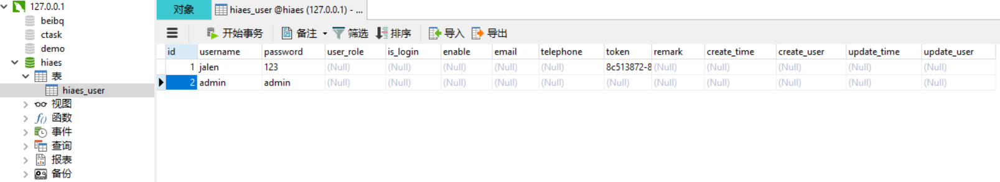
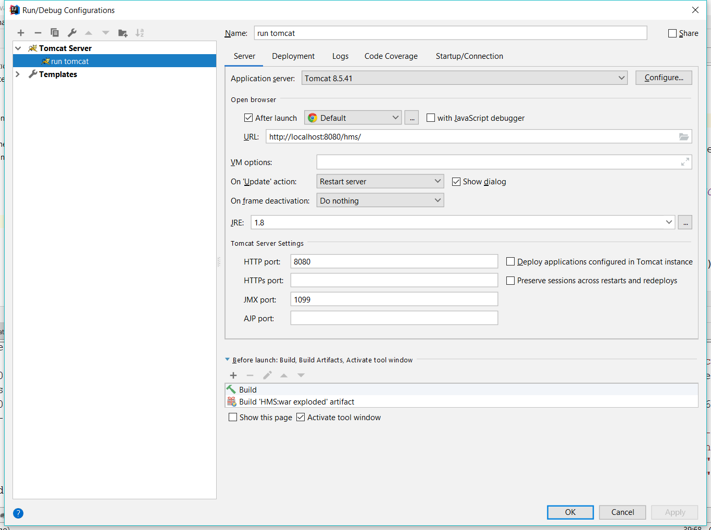
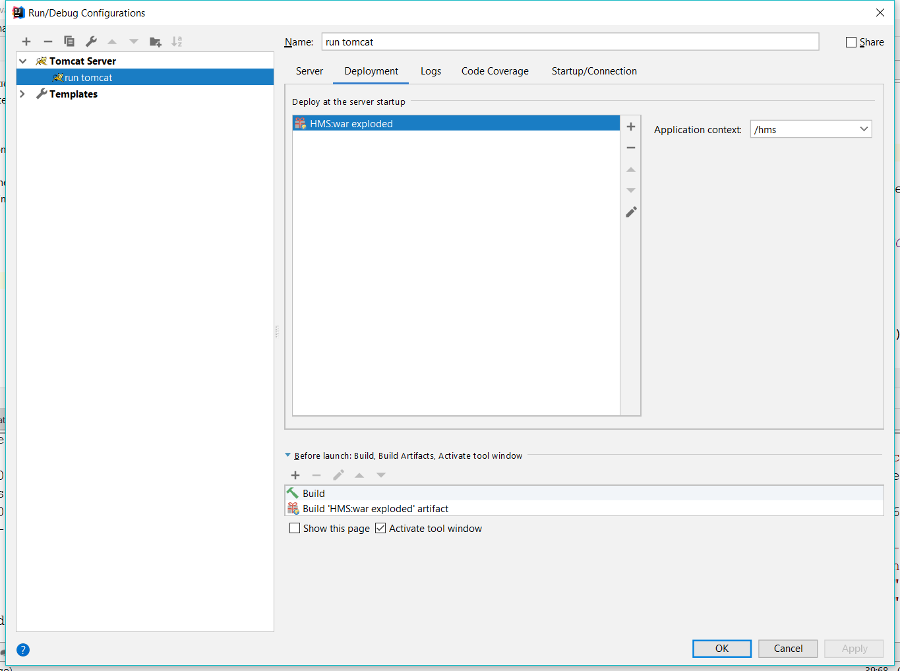
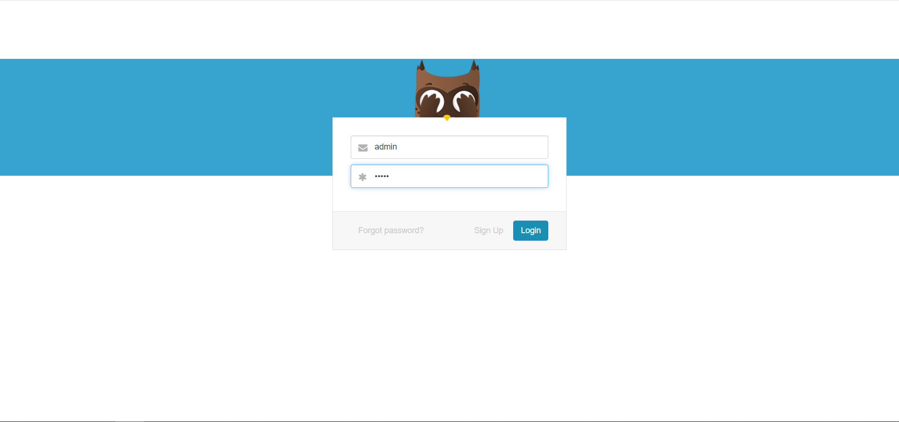
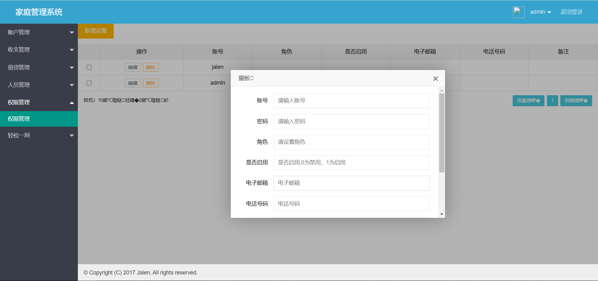

## 管理后台

> 一个小系统的雏形，sprint mvc + maven + layui

**1.引入一些Jar包**

简单的SSM后台框架

- spring：4.3.9.RELEASE
- lombok
- guava
- quartz
- ehcache
- mybatis
- mysql

**2.执行resource下sql目录的sql**

在表里添加用户

**2.IDEA 配置**

**3.系统UI**

